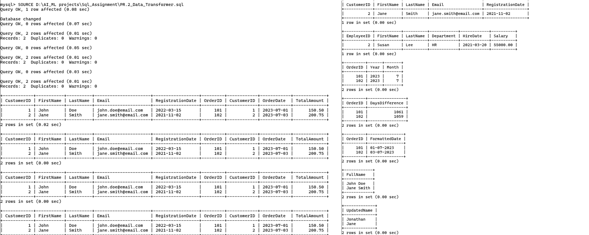

# 🚀 SQL Data Transformer

A beginner-friendly SQL project focused on data transformation, manipulation, and query processing concepts.

## 📌 About This Project
This repository contains:
- Data transformation operations
- String manipulation functions
- Date and time functions
- Data formatting techniques
- SQL query processing
- Beginner-friendly database exercises

## 📂 Files Included
- `PR.2_Data_Transformer.sql` → SQL file containing transformation and manipulation queries
- `PR.2_Data_Transformer.png` → Output screenshot of SQL query execution

## 🛠 Technologies Used
- SQL
- MySQL

## 🎯 Learning Goals
This project helps in understanding:
- Data transformation concepts
- SQL string functions
- Date and time functions
- Data formatting techniques
- SQL query execution and analysis

## 📸 Project Output

## 👨‍💻 Author
**Yashraj Sharma**

---
⭐ If you like this project, don't forget to star the repository.
